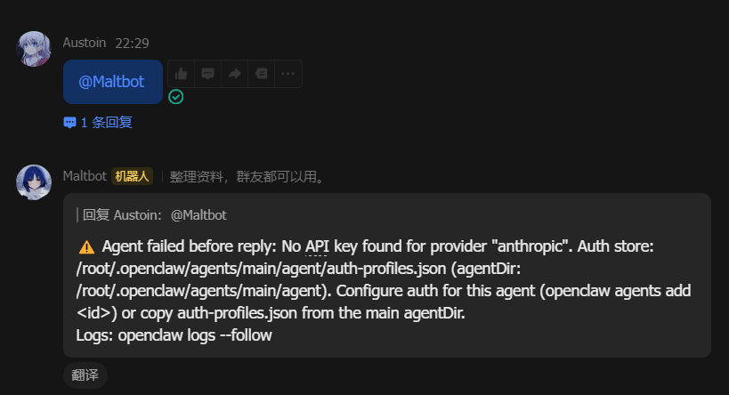
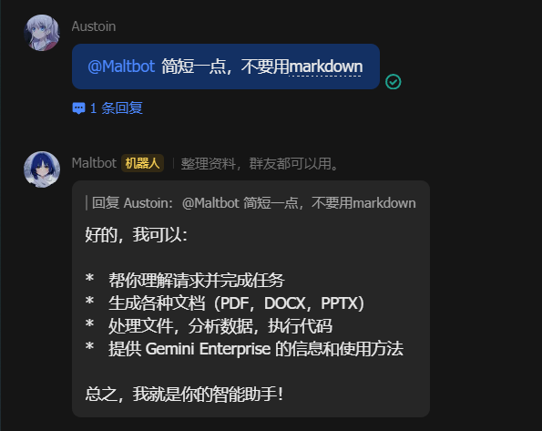

# OpenClaw 飞书 AI 助手部署指南

本指南记录了在 **UCloud/腾讯云** 环境下，结合 **宝塔面板** 部署 **OpenClaw (2026.1.29)** 并接入 **飞书机器人** 的完整流程。

## 🛠 一、环境准备

1. **服务器**：UCloud 或腾讯云轻量应用服务器（建议选用已集成镜像）

2. **管理面板**：宝塔面板（用于简化防火墙管理）

3. **飞书应用**：[飞书开放平台](https://open.feishu.cn/app) 自建应用

## 🚀 二、安装 OpenClaw

执行官方一键安装脚本：

```bash
curl -fsSL https://openclaw.ai/install.sh | bash
```

安装完成后，运行初始化配置：

```bash
openclaw doctor --fix
```

## ⚙️ 三、网关配置

1. **设置网关模式**：

   ```bash
   openclaw config set gateway.mode local
   ```

2. **配置外网监听**（关键步骤）：

   ```bash
   openclaw gateway stop
   openclaw config set gateway.bind lan
   openclaw gateway run
   ```

   > **注意**：使用 `lan` 关键字可以开启公网监听，避免使用 `0.0.0.0` 或 `any` 可能导致的校验问题。

3. **对齐网关 Token**（解决认证问题）：

   ```bash
   openclaw config set gateway.remote.token $(openclaw config get gateway.auth.token)
   ```

## 🔌 四、安装飞书插件

使用正确的插件包名进行安装：

```bash
# 设置国内镜像源（加速下载）
export NPM_CONFIG_REGISTRY=https://registry.npmmirror.com

# 安装官方飞书插件
openclaw plugins install @m1heng-clawd/feishu
```

## 📝 五、配置飞书凭证

在终端依次执行以下命令配置飞书应用信息：

```bash
# 设置 App ID
openclaw config set channels.feishu.appId "cli_a9f6f9421e7c5bd2"

# 设置 App Secret
openclaw config set channels.feishu.appSecret "FblscUBzgWkd9NzGKXbjieYg8BXem4Jy"

# 设置 Verification Token
openclaw config set channels.feishu.verificationToken "TXanHtVq7vbQPiloMdvNre5FtpFqP3t3"

# 启用飞书通道
openclaw config set channels.feishu.enabled true
```

配置完成后重启网关：

```bash
openclaw gateway restart
```

## 🧱 六、防火墙配置（关键）

必须在 **两个层面** 放行 **TCP 18789** 端口：

1. **云平台防火墙**：登录 UCloud/腾讯云控制台，在防火墙规则中放行 TCP 18789

2. **宝塔面板安全**：
   - 登录宝塔面板 → 点击"安全" → 点击"添加放行端口"
   - 输入 18789，备注填写"飞书机器人"
   - 点击"确定"

## 🤖 七、飞书开放平台配置

### 1. 获取凭证

在飞书应用后台获取以下信息：
- **App ID**：凭证与基础信息页面
- **App Secret**：凭证与基础信息页面
- **Verification Token**：事件与回调 → 加密策略标签页

### 2. 配置事件订阅

进入"事件与回调" → "事件配置"页面：

1. **添加事件**：点击"添加事件"，搜索并添加：
   - `im.message.receive_v1`（接收消息）
   - `im.message.at_receive_v1`（接收@机器人消息）

2. **选择订阅方式**（推荐长连接模式）：
   - 切换到"回调配置"标签页
   - 勾选 **"使用长连接接收回调"**
   - 点击"保存"

   > **长连接模式优势**：无需配置公网 IP 和 Webhook 地址，不受防火墙限制，更稳定

### 3. 发布版本

1. 进入"版本管理与发布"
2. 点击"创建版本"，填写版本号（如 1.0.0）
3. 点击"保存"，然后点击"申请上线"
4. 等待管理员审核通过（或自行审核）

## ✅ 八、验证与测试

1. **检查服务状态**：

   ```bash
   openclaw doctor
   ```

2. **测试机器人**：
   - 在飞书中搜索你的机器人名称
   - 发送"你好"进行测试

## ⚠️ 常见问题排查

| 问题 | 解决方案 |
|------|----------|
| 请求3秒超时 | 检查 `gateway.bind` 是否为 `lan`，确认宝塔和云平台已放行 18789 端口 |
| JSON 格式不合法 | Webhook 模式下 Token 不匹配，建议改用"长连接"模式 |
| Unrecognized key "feishu" | 配置前缀应使用 `channels.feishu` 而非 `plugins.feishu` |
| gateway token mismatch | 执行 `openclaw config set gateway.remote.token $(openclaw config get gateway.auth.token)` |
| 飞书验证失败 | 确保 Verification Token 与飞书后台一致，配置路径为 `channels.feishu.verificationToken` |
| 机器人无响应 | 检查是否已发布版本，模型配置是否正确 |

## 📚 参考资料

- [OpenClaw 官方文档](https://docs.openclaw.ai/)
- [飞书开放平台文档](https://open.feishu.cn/document/)

#### > 参考网址：https://mp.weixin.qq.com/s/NgT0QVBq3q0hJ6Y4pIXSWA

**到了这一步试试能不能访问机器人了，出现下面的情况就说明成功了，剩下的就是配置你自己的api了，参考我的 openclaw-after.json文件**



> 添加了 api 后记得重启服务 ：openclaw gateway restart

**然后就可以了**

